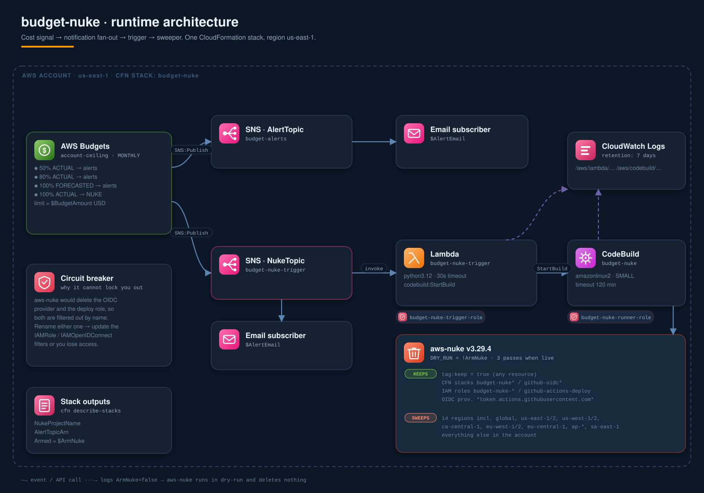
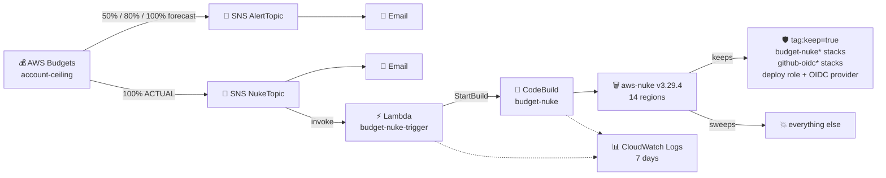
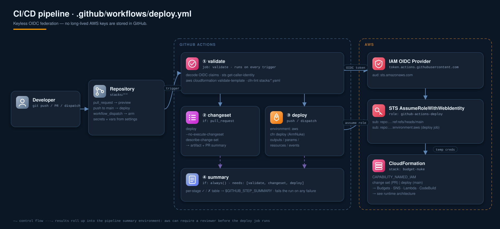
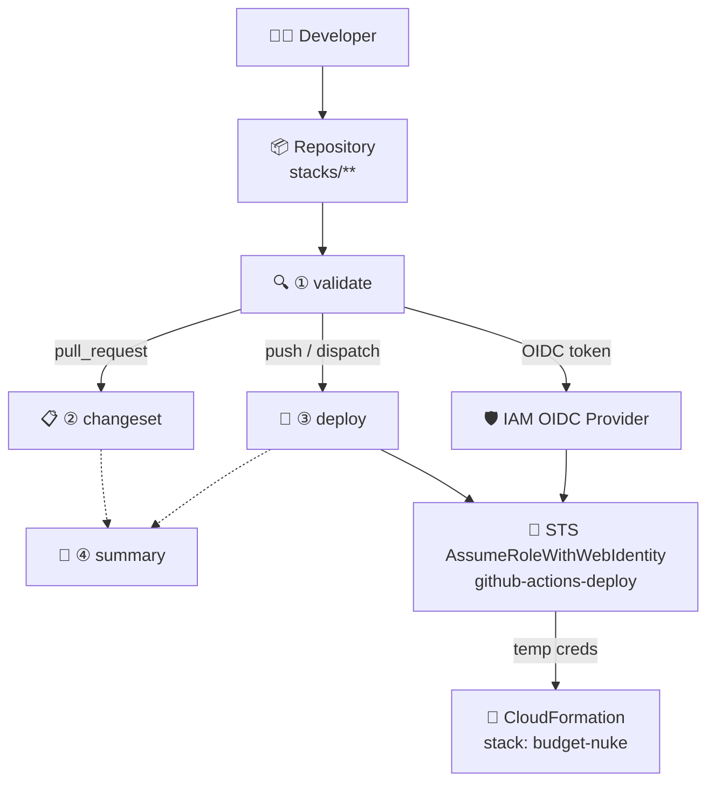
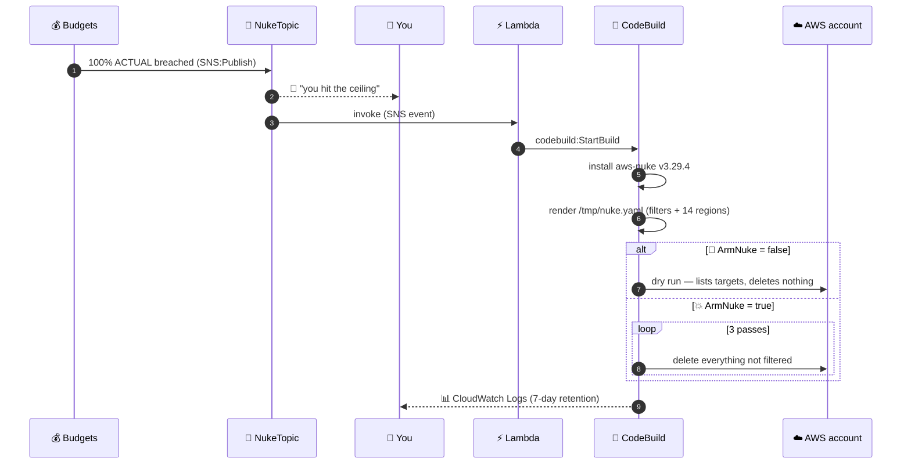

<h1 align="center">🔥 budget-nuke</h1>

<p align="center">
  <em>A cost ceiling with teeth. AWS Budgets watches the spend, SNS fans out the alarm,<br/>
  Lambda pulls the trigger, CodeBuild runs <code>aws-nuke</code>. Anything tagged <code>keep=true</code> survives.</em>
</p>

<p align="center">
  
  
  
  
  
</p>

---

## 🧭 Table of contents

| # | Section |
|---|---|
| 🏗️ | [Architecture](#️-architecture) |
| 🔄 | [CI/CD pipeline](#-cicd-pipeline) |
| 📁 | [Repo layout](#-repo-layout) |
| 🧱 | [Resource inventory](#-resource-inventory) |
| ⛓️ | [Sequence: budget breach → nuke](#️-sequence-budget-breach--nuke) |
| 🚦 | [Trigger matrix](#-trigger-matrix) |
| 🛠️ | [Setup](#️-setup) |
| 🔥 | [Arming](#-arming) |
| 🛡️ | [Safety & circularity](#️-safety--circularity) |
| 📤 | [Outputs](#-outputs) |
| 📝 | [Notes](#-notes) |

---

## 🏗️ Architecture

The whole runtime lives in **one** CloudFormation stack (`budget-nuke`) in **us-east-1** — Budgets is a global service that only speaks in that region.

<p align="center">
  
</p>

**The circuit in one line:** `Budgets` ⟶ `SNS` ⟶ `Lambda` ⟶ `CodeBuild` ⟶ `aws-nuke`.

| Stage | Service | What happens | Emits |
|---|---|---|---|
| 1️⃣ Watch | 💰 **AWS Budgets** | `account-ceiling`, MONTHLY, `$BudgetAmount` USD | 4 notifications |
| 2️⃣ Warn | 📣 **SNS `AlertTopic`** | 50% / 80% actual + 100% forecasted | 📧 email to you |
| 3️⃣ Alarm | 📣 **SNS `NukeTopic`** | 100% **actual** — the only threshold that arms anything | 📧 email + ⚡ Lambda |
| 4️⃣ Trigger | ⚡ **Lambda `budget-nuke-trigger`** | python3.12, 30s, calls `codebuild:StartBuild` | build id |
| 5️⃣ Sweep | 🔨 **CodeBuild `budget-nuke`** | pulls `aws-nuke` v3.29.4, 120 min timeout | 3 delete passes |
| 6️⃣ Observe | 📊 **CloudWatch Logs** | `/aws/lambda/…` + `/aws/codebuild/…`, 7-day retention | logs |

> [!IMPORTANT]
> `ArmNuke=false` (the default) sets `DRY_RUN=true` in CodeBuild. The whole chain still fires — it just **prints** what it would delete instead of deleting it.

<details>
<summary>📐 Same diagram as Mermaid (text fallback)</summary>



</details>

---

## 🔄 CI/CD pipeline

No AWS access keys are stored anywhere. GitHub mints a short-lived OIDC token, AWS STS trades it for temporary credentials scoped to one repo and one branch.

<p align="center">
  
</p>

### Stages

| # | Job | Runs when | Does |
|---|---|---|---|
| ① | 🔍 **validate** | every trigger | 🧾 run context · 🪪 decode OIDC claims · 🧑‍💼 `sts get-caller-identity` · ✅ `validate-template` · 🧹 `cfn-lint` |
| ② | 📋 **changeset** | `pull_request` | 📋 `deploy --no-execute-changeset` · 🔬 `describe-change-set` · 📤 artifact + PR summary |
| ③ | 🚀 **deploy** | `push` to `main` / `workflow_dispatch` | 🔎 pre-deploy state · 🚀 `cfn deploy` · 📊 outputs · ⚙️ params · 🧱 resources · 🕒 events |
| ④ | 🧾 **summary** | `always()` | ✅/❌/🚫/⏭️ per-stage report to `$GITHUB_STEP_SUMMARY`, fails the run if any stage failed |

Every step wraps its output in `::group::` blocks and every job writes a markdown block to the job summary, so the run page is readable without digging through raw logs.

<details>
<summary>📐 Same pipeline as Mermaid</summary>



</details>

---

## 📁 Repo layout

```
AWS/
├── .github/
│   └── workflows/
│       └── deploy.yml            🔄 validate → changeset → deploy → summary
├── docs/
│   ├── architecture.svg          🏗️ runtime architecture diagram
│   └── pipeline.svg              🔄 CI/CD diagram
├── stacks/
│   └── budget-nuke.yaml          🔥 the whole runtime (SNS, Budgets, Lambda, CodeBuild, IAM, Logs)
├── github-oidc-bootstrap.yaml    🛡️ deployed BY HAND, once — not by the pipeline
└── README.md
```

> `github-oidc-bootstrap.yaml` deliberately sits **outside** `stacks/`. The pipeline only watches `stacks/**`, so the thing that grants the pipeline its own access is never modified by the pipeline.

---

## 🧱 Resource inventory

<details open>
<summary><strong>stacks/budget-nuke.yaml</strong> — deployed by the pipeline</summary>

| Logical ID | Type | Note |
|---|---|---|
| `Budget` | `AWS::Budgets::Budget` | 💰 4 thresholds: 50/80 actual, 100 forecast, 100 actual |
| `AlertTopic` / `AlertTopicPolicy` | `AWS::SNS::Topic` + policy | 📣 warnings; policy lets `budgets.amazonaws.com` publish |
| `NukeTopic` / `NukeTopicPolicy` | `AWS::SNS::Topic` + policy | 💣 the one that matters |
| `AlertSubscription` / `NukeAlertSubscription` | `AWS::SNS::Subscription` | 📧 email on **both** topics (100% actual only carries one SNS subscriber) |
| `TriggerSubscription` / `TriggerPermission` | subscription + permission | 🔗 lets SNS invoke the Lambda |
| `TriggerRole` | `AWS::IAM::Role` | 🛡️ basic execution + `codebuild:StartBuild` on the project ARN only |
| `TriggerFunction` | `AWS::Lambda::Function` | ⚡ inline python3.12, 8 lines |
| `NukeRole` | `AWS::IAM::Role` | 🛡️ `AdministratorAccess` — it has to delete arbitrary resources |
| `NukeProject` | `AWS::CodeBuild::Project` | 🔨 `NO_SOURCE`, inline buildspec, `DRY_RUN = !ArmNuke` |
| `TriggerLogGroup` / `NukeLogGroup` | `AWS::Logs::LogGroup` | 📊 7-day retention |

**Parameters:** `BudgetAmount` (default `10`) · `AlertEmail` · `ArmNuke` (`true`/`false`, default `false`)

</details>

<details>
<summary><strong>github-oidc-bootstrap.yaml</strong> — deployed by hand, once</summary>

| Logical ID | Type | Note |
|---|---|---|
| `GitHubOIDCProvider` | `AWS::IAM::OIDCProvider` | 🛡️ `token.actions.githubusercontent.com`, audience `sts.amazonaws.com` |
| `GitHubDeployRole` | `AWS::IAM::Role` | 🔑 `github-actions-deploy`, 1h max session, trust scoped by `sub` claim |

Trusted subjects:

```
repo:…:ref:refs/heads/main        ← jobs WITHOUT `environment:`
repo:…:ref:refs/heads/dev
repo:…:ref:refs/heads/feature/*
repo:…:environment:aws            ← the deploy job, which DOES set `environment:`
```

⚠️ A job with `environment: aws` gets the **environment** subject form *instead of* the ref form. Drop that last line and the deploy job can no longer assume the role.

</details>

---

## ⛓️ Sequence: budget breach → nuke



---

## 🚦 Trigger matrix

| Trigger | Jobs that run | Applies changes? | Arms the nuke? |
|---|---|---|---|
| 🔀 Pull request touching `stacks/` | 🔍 validate → 📋 changeset → 🧾 summary | ❌ preview only | ❌ |
| 🚢 Push to `main` | 🔍 validate → 🚀 deploy → 🧾 summary | ✅ | ❌ always `false` |
| 🎛️ Manual dispatch | 🔍 validate → 🚀 deploy → 🧾 summary | ✅ | ⚠️ your choice |

Arming is deliberately manual. A push can never arm it — the workflow falls back to `ArmNuke=false` whenever the run wasn't a `workflow_dispatch`.

---

## 🛠️ Setup

### 1️⃣ Bootstrap (manual, once)

First find your OIDC subject prefix — everything before the trailing `:ref:…` / `:environment:…` segment:

```bash
gh api repos/OWNER/REPO/actions/oidc/customization/sub
# legacy format    : repo:owner/repo
# immutable format : repo:owner@123456/repo@789012   (repos created or renamed after 2026-07-15)
```

Then deploy the bootstrap stack:

```bash
aws cloudformation deploy \
  --template-file github-oidc-bootstrap.yaml \
  --stack-name github-oidc \
  --region us-east-1 \
  --capabilities CAPABILITY_NAMED_IAM \
  --parameter-overrides SubjectClaimPrefix='repo:OWNER/REPO'
```

Copy the `DeployRoleArn` output.

### 2️⃣ Repo settings

**Settings → Secrets and variables → Actions**

| Kind | Name | Value |
|---|---|---|
| 🔒 Secret | `AWS_DEPLOY_ROLE_ARN` | the ARN from step 1 |
| 🔒 Secret | `ALERT_EMAIL` | your email |
| 🔧 Variable | `BUDGET_AMOUNT` | e.g. `10` |

### 3️⃣ Environment gate (recommended)

**Settings → Environments → New environment → `aws`**

Add yourself under **Required reviewers**. Arming the nuke then needs an approval click instead of firing on a dispatch.

⚠️ The workflow references `environment: aws`. Skip this step and either delete that line or deploys will hang waiting for an environment that doesn't exist.

### 4️⃣ Push

```bash
git add . && git commit -m "budget nuke" && git push
```

Deploys **disarmed**. Confirm the two SNS subscription emails that arrive.

---

## 🔥 Arming

**Actions → 🚀 Deploy CloudFormation → Run workflow → `arm_nuke: true`**

Test first: run the `budget-nuke` CodeBuild project manually while `ArmNuke=false` and read the dry-run log. Only arm once that list looks right.

---

## 🛡️ Safety & circularity

The nuke would happily delete the OIDC provider and the deploy role, locking GitHub out of the account permanently. Four filters in `budget-nuke.yaml` prevent that:

| Filter | Keeps |
|---|---|
| `__global__` → `tag:keep = true` | 🏷️ anything you tagged |
| `CloudFormationStack` | `budget-nuke*`, `github-oidc*` |
| `IAMRole` / `IAMRolePolicyAttachment` | `budget-nuke-runner-role`, `budget-nuke-trigger-role`, `github-actions-deploy` |
| `IAMOpenIDConnectProvider` | `*token.actions.githubusercontent.com*` |
| `CodeBuildProject` / `LambdaFunction` / `SNSTopic` / `SNSSubscription` | the stack's own machinery |

> [!WARNING]
> Rename any of those resources and you **must** update the matching filter, or the first live run deletes your own access.

---

## 📤 Outputs

| Output | Meaning |
|---|---|
| `NukeProjectName` | 🔨 CodeBuild project to run manually for a dry-run test |
| `AlertTopicArn` | 📣 the warnings topic |
| `Armed` | 💣 current value of `ArmNuke` |

The 🚀 deploy job prints these as a table **and** as JSON, plus the stack parameters, all resources, and the last 25 stack events — then uploads `outputs.json`, `resources.txt` and `events.txt` as artifacts.

---

## 📝 Notes

- 🌍 Region is pinned to `us-east-1` in the workflow. Budgets only lives there.
- 🔐 The deploy role is scoped to one repo and specific branches. A fork or another branch cannot assume it.
- 🛡️ `AdministratorAccess` on the deploy role is needed because the nuke stack creates IAM roles. Narrow it if you later split IAM into its own stack.
- 🧪 `aws-nuke` runs 3 passes when live — dependency ordering means a single pass usually leaves stragglers.
- 💸 Pipeline cost: **$0**. Public repos get unlimited Actions minutes; private repos get 2,000/month.
